# SDN-Based Access Control System

**Course:** Computer Networks — UE24CS252B  
**Name:** Paras Agarwal  
**SRN:** PES1UG24CS316  
**GitHub:** [ParasAgarwal23/sdn-access-control](https://github.com/ParasAgarwal23/sdn-access-control)

---

## Problem Statement

Allow only authorized hosts to communicate within the network using an SDN controller that maintains a whitelist of permitted host pairs and blocks all unauthorized traffic.

---

## Project Overview

This project implements an SDN-based access control system using:
- **Mininet** — network emulation
- **Ryu** — OpenFlow 1.3 SDN controller
- **OpenFlow 1.3** — used for match-action rule enforcement on the switch

The controller enforces a host whitelist. Only whitelisted IP pairs are permitted to communicate. All other IP traffic is silently dropped at the switch level using OpenFlow flow rules.

When a new flow's first packet arrives at the switch with no matching rule, it triggers a **packet_in event**, sending the packet up to the Ryu controller. The controller inspects the source and destination IP, checks the whitelist, and installs an appropriate allow or drop flow rule back on the switch — so all future packets of that flow are handled at line rate without involving the controller again.

---

## Topology

```
h1 (10.0.0.1) ─┐
h2 (10.0.0.2) ──── s1 ──── Ryu Controller (port 6633)
h3 (10.0.0.3) ─┘
```

- **h1 and h2** — Authorized (whitelisted, can communicate freely)
- **h3** — Unauthorized (all traffic blocked by controller)

---

## Topology and Design Justification

A **single switch topology** was chosen for this project for the following reasons:

- **Simplicity and clarity** — Access control logic is best demonstrated on a flat topology where all enforcement happens at one switch, making flow rule behavior easy to observe and verify.
- **Sufficient for the problem** — The goal is to demonstrate whitelist-based host filtering. A single switch with 3 hosts (2 authorized, 1 unauthorized) cleanly covers all test scenarios: authorized communication, unauthorized blocking, and mixed connectivity.
- **Scalable design** — The whitelist in `access_control.py` is a simple list that can be extended to any number of host pairs without changing the controller logic, making it easy to scale to larger topologies.
- **Ryu chosen over POX** — Ryu is actively maintained, supports OpenFlow 1.3, and has better Python 3 compatibility, making it more suitable for this project.
- **OpenFlow 1.3 chosen** — Provides fine-grained match fields (src/dst IP), priority-based rule ordering, and idle timeouts — all needed for clean access control enforcement.

---

## File Structure

```
sdn-access-control/
├── access_control.py    # Ryu controller with whitelist enforcement
├── topology.py          # Mininet topology (1 switch, 3 hosts)
├── regression_test.py   # Automated policy consistency tests
├── screenshots/         # Proof of execution screenshots
└── README.md            # This file
```

---

## Features

- Whitelist-based host access control
- Dynamic OpenFlow flow rule installation (allow/deny) via packet_in events
- Uses OpenFlow 1.3 for match-action rule enforcement
- MAC learning to avoid unnecessary flooding
- Automatic rule expiry via idle timeout
- Real-time ALLOW/BLOCK logging from controller
- Automated regression testing for policy consistency

---

## Requirements

- Ubuntu 20.04 / 22.04
- Python 3.8+
- Mininet (installed from source)
- Ryu SDN Controller 4.34
- Open vSwitch

---

## Installation

### 1. Install Mininet from source

```bash
git clone https://github.com/mininet/mininet
cd mininet
sudo ./util/install.sh -a
cd ~
sudo python3 mininet/setup.py install
```

### 2. Install Ryu

```bash
python3 -m pip install ryu --break-system-packages
python3 -m pip uninstall eventlet -y
python3 -m pip install eventlet==0.30.2 --break-system-packages
```

### 3. Clone this repository

```bash
git clone https://github.com/ParasAgarwal23/sdn-access-control.git
cd sdn-access-control
```

---

## Execution

### Step 1 — Start Ryu Controller (Terminal 1)

```bash
python3 -m ryu.cmd.manager access_control.py
```

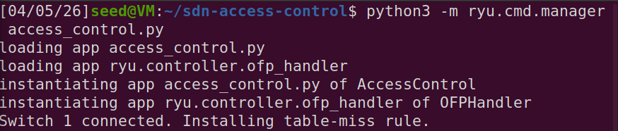

### Step 2 — Start Mininet Topology (Terminal 2)

```bash
sudo python3 topology.py
```

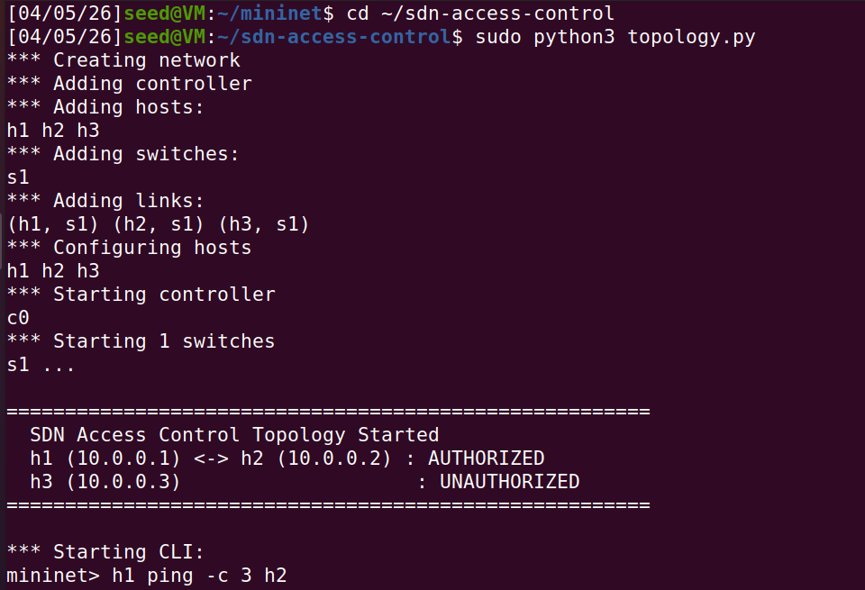

---

## SDN Controller Logic

The `access_control.py` Ryu controller works as follows:

1. **Switch connects** — A default table-miss rule is installed at priority 0, sending all unmatched packets to the controller.
2. **packet_in event** — The first packet of any new flow has no matching rule on the switch, so it is sent to the controller.
3. **Whitelist check** — The controller extracts the source and destination IP from the packet and checks against the whitelist.
4. **Flow rule installation** — If authorized, a high-priority allow rule is pushed to the switch. If unauthorized, a high-priority drop rule (empty action list) is pushed instead.
5. **Subsequent packets** — All future packets of that flow are handled directly by the switch at line rate, without involving the controller again.

---

## Testing and Validation

### Test 1 — Authorized vs Unauthorized Communication

**Terminal 1 (Mininet):**
```bash
mininet> h1 ping -c 3 h2
mininet> h3 ping -c 3 h1
```

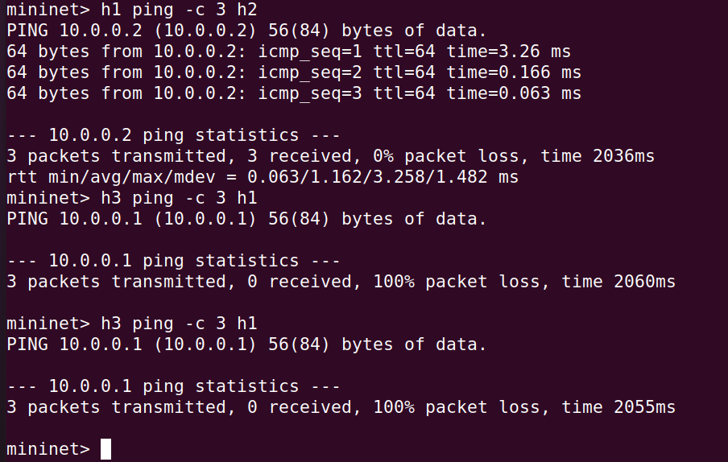

**Terminal 2 (Ryu) — Controller ALLOW/BLOCK decisions:**

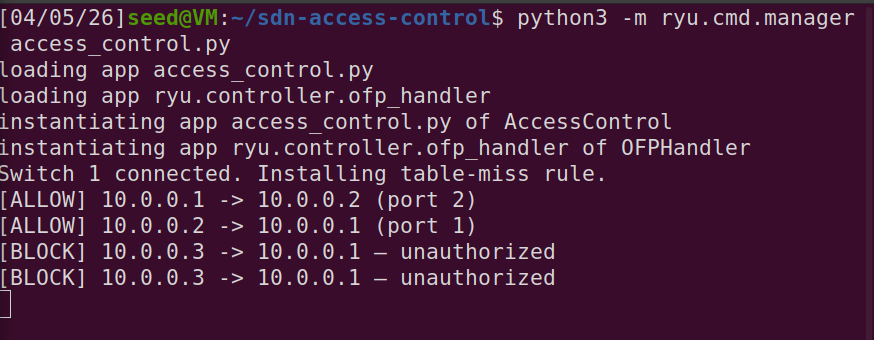

**Results:**
- h1 → h2 : **0% packet loss** (authorized ✓)
- h3 → h1 : **100% packet loss** (blocked ✓)

---

### Test 2 — Full Connectivity Matrix (pingall)

**Terminal 1 (Mininet):**
```bash
mininet> pingall
```

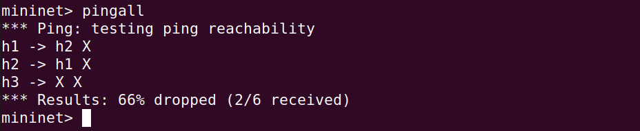

**Terminal 2 (Ryu) — Controller logs showing all decisions:**

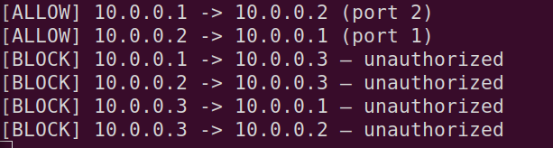

**Result:** 66% dropped — only h1 ↔ h2 allowed (2/6 received) ✓

---

### Test 3 — Flow Table Dump

```bash
mininet> sh ovs-ofctl dump-flows s1
```

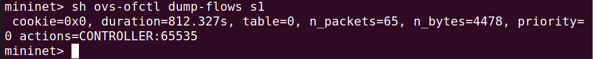

**Explanation:**
- Flow rules match on source and destination IP addresses.
- Authorized traffic is forwarded to the correct port, while unauthorized traffic is dropped by installing no-action (drop) rules with higher priority than the default table-miss rule.

---

### Test 4 — Throughput Test (iperf)

```bash
mininet> h1 iperf -s &
mininet> h2 iperf -c h1
```

**Terminal 1 (Mininet) — iperf client output:**

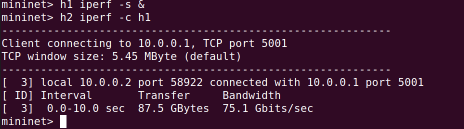

**Terminal 2 (Ryu) — iperf server output:**

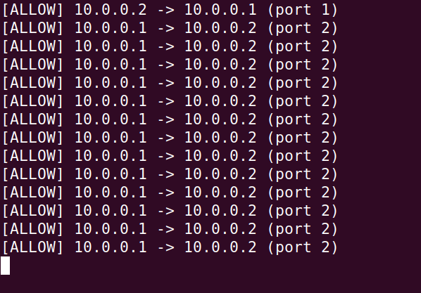

**Result:** 75.1 Gbits/sec bandwidth between authorized hosts h1 and h2 ✓

---

### Test 5 — Scenario Verification (All Directions)

Re-running all combinations to verify consistent behavior across all host pairs:

**Terminal 1 (Mininet):**

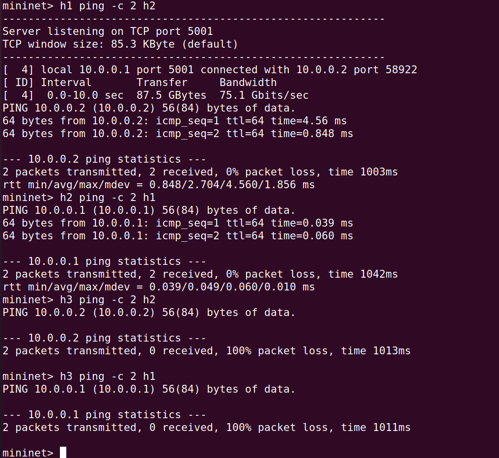

**Terminal 2 (Ryu) — Controller decisions:**

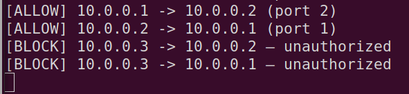

**Results:**
- h1 → h2 : **0% packet loss** ✓
- h2 → h1 : **0% packet loss** ✓
- h3 → h2 : **100% packet loss** ✓
- h3 → h1 : **100% packet loss** ✓

---

### Test 6 — Regression Test (Policy Consistency)

Exit Mininet first, then run:

```bash
sudo python3 regression_test.py
```

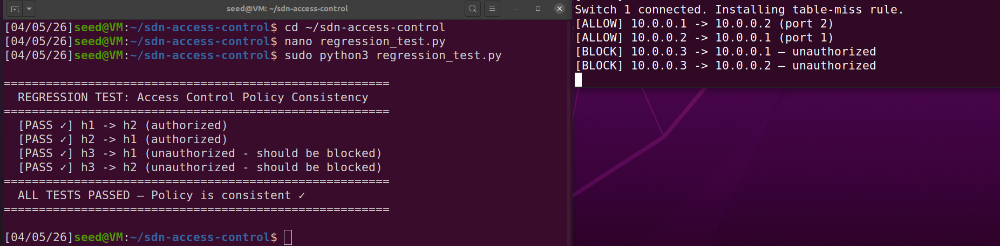

**Result:** ALL TESTS PASSED — Policy is consistent ✓

The regression test re-runs all access control scenarios automatically and verifies that the whitelist policy has not regressed after any code changes.

---

### Topology Cleanup

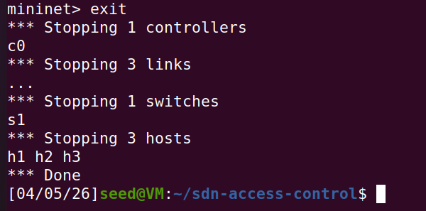

---

## Expected Behavior Summary

| Source | Destination | Expected | Result |
|--------|-------------|----------|--------|
| h1 | h2 | ALLOW | ✓ 0% packet loss |
| h2 | h1 | ALLOW | ✓ 0% packet loss |
| h3 | h1 | BLOCK | ✓ 100% packet loss |
| h3 | h2 | BLOCK | ✓ 100% packet loss |

---

## References

- [Mininet](http://mininet.org/)
- [Ryu SDN Framework](https://ryu-sdn.org/)
- [OpenFlow 1.3 Specification](https://opennetworking.org/wp-content/uploads/2014/10/openflow-spec-v1.3.0.pdf)
- [Open vSwitch](https://www.openvswitch.org/)
- [Mininet Walkthrough](https://mininet.org/walkthrough/)
